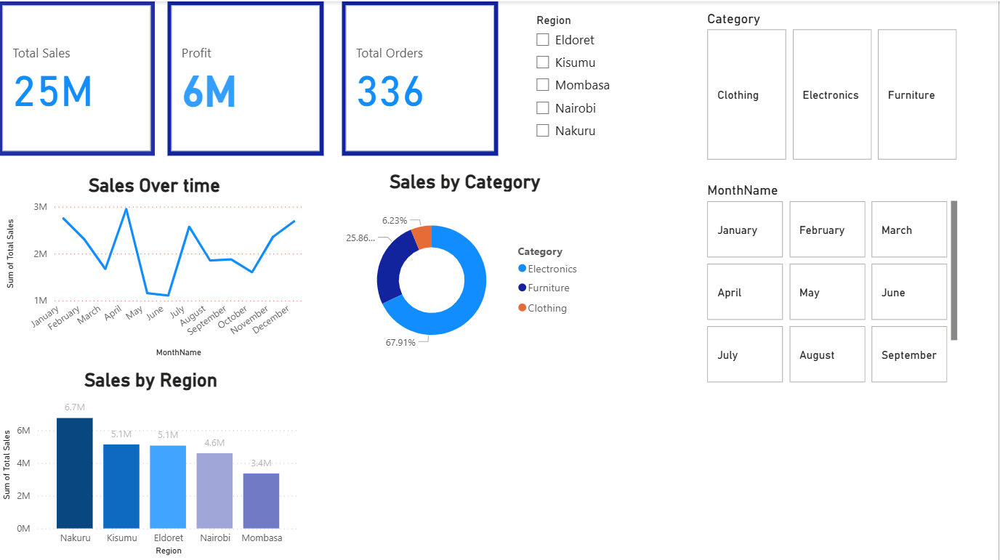

Performance Sales Dashboard
📊 Overview
This Power BI dashboard provides an interactive overview of company sales performance, covering Total Sales, Profit, and Orders across different regions, categories, and months.
It is designed for quick business insights and data-driven decision-making.

📈 Key Features
KPI Cards:

Total Sales: 25M

Profit: 6M

Total Orders: 336

Sales Over Time: Line chart tracking monthly sales trends.

Sales by Category: Donut chart showing share of sales in Electronics, Furniture, and Clothing.

Sales by Region: Bar chart comparing regional sales performance.

Interactive Filters:

Region

Category

Month

🗂 Data
Source: Source: Artificial dataset generated with the help of ChatGPT for demonstration purposes.

Note: This dataset is entirely fictional and does not represent any real company or actual sales figures.

Data Fields:

Sales

Profit

Order Count

Category

Region

Month Name

💡 Insights
Clothing dominates sales with 67.91% share.

Nakuru region has the highest sales at 6.7M.

Sales show seasonal fluctuations, peaking in May.

🖼 Preview

🛠 Tools Used
Power BI – Data modeling, DAX calculations, and interactive dashboard design.

Excel / CSV – Data preparation (if applicable).

📂 Repository Structure
bash
Copy
Edit
Performance-Data-Dashboard/
│── Performance sales.pbix     # Power BI dashboard file
│── dashboard.png               # Screenshot of the dashboard
│── README.md                   # Project documentation
│── data/                       # Raw or sample data (if public)
📜 How to Use
Clone the repository:

bash
Copy
Edit
git clone https://github.com/username/Performance-Data-Dashboard.git
Open Performance sales.pbix in Power BI Desktop.

Interact with the slicers and visuals to explore insights.

⚠ Disclaimer
This dashboard uses sample data and is intended for educational and portfolio purposes only.

